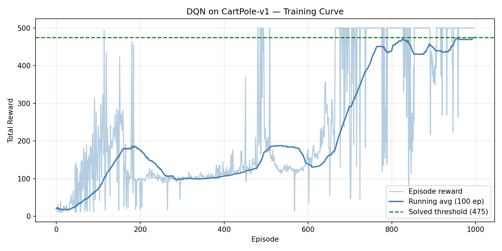

# DQN CartPole-v1

Vanilla DQN (Deep Q-Network) implementation from scratch using PyTorch, trained on CartPole-v1.

**Result: Solved in ~950 episodes — 10/10 perfect scores (500/500) on evaluation.**




## What is this

CartPole is a classic RL control problem: balance a pole on a moving cart by pushing left or right. The environment gives +1 reward per step survived. The task is considered **solved** when the agent achieves a 100-episode running average ≥ 475 (out of 500 max).

This implementation trains a DQN agent from scratch — no RL libraries, just PyTorch.

## Architecture

```
State (4,) → Linear(128) → ReLU → Linear(128) → ReLU → Q-values (2,)
```

Key components:
- **Q-Network + Target Network** — target network synced every 5 episodes for stable training
- **Experience Replay** — 10,000-capacity buffer, random sampling to break temporal correlation
- **ε-greedy exploration** — ε decays from 1.0 → 0.01 (decay rate 0.99 per episode)
- **Gradient clipping** — norm clipped at 10 to prevent policy collapse

| Hyperparameter | Value |
|---|---|
| Learning rate | 5e-4 |
| Discount factor (γ) | 0.99 |
| Batch size | 64 |
| Replay buffer | 10,000 |
| Target update freq | every 5 episodes |
| Hidden units | 128 × 2 |

## Evaluation

```
Episode  1  reward: 500.0
Episode  2  reward: 500.0
Episode  3  reward: 500.0
...
Episode 10  reward: 500.0

Mean reward over 10 episodes: 500.0
```

## Usage

```bash
pip install torch gymnasium numpy matplotlib

# Train
python train.py

# Evaluate trained model
python evaluate.py
```

Trained on NVIDIA GeForce RTX 5060 Laptop GPU. CPU training also works.

## Files

| File | Description |
|------|-------------|
| `dqn_agent.py` | QNetwork, ReplayBuffer, DQNAgent |
| `train.py` | Training loop, saves model + curve |
| `evaluate.py` | Load model, run evaluation episodes |
| `results/dqn_cartpole.pth` | Trained model weights |
| `results/training_curve.png` | Training curve |
